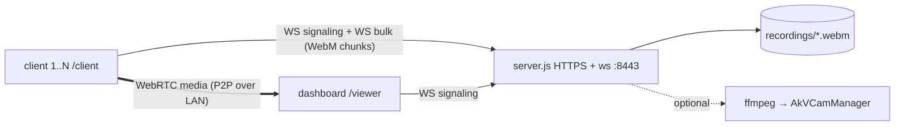

# synora

*syn + hórama — "seeing together".*

Multi-client camera system for a local network. N clients stream video peer-to-peer (WebRTC) to a single browser dashboard; the server handles signaling, per-device recording, and optionally exposes a feed as a Windows virtual webcam. With ArUco tags placed in the room, the clients additionally localize themselves in a shared room frame, shown live in 3D and 2D room views.

No build step, no app install: vanilla JS served as static files. A client is any phone (or tablet) pointed at a web page.

## Contents

- [Setup](#setup)
- [Architecture](#architecture)
- [Frame sync](#frame-sync)
- [Room positioning](#room-positioning)
- [Devices](#devices)
- [Client roster and remote control](#client-roster-and-remote-control)
- [Virtual webcam](#virtual-webcam)
- [Recordings](#recordings)
- [Project layout](#project-layout)
- [Troubleshooting](#troubleshooting)

## Setup

Requirements: Node ≥ 18. Clients and PC on the same LAN.

```bash
npm install
npm run fetch-vendor   # opencv.js, three.js — required for positioning
npm start              # or: npm run dev (node --watch)
```

`fetch-vendor` downloads third-party assets into a gitignored directory (`public/vendor/`). Without them the server runs and streams; the positioning features are disabled, and the startup log lists what is missing.

The server listens on `:8443` (HTTPS + WSS) and prints both URLs and a QR code:

- Dashboard: `https://localhost:8443/viewer`
- Clients: `https://<LAN-IP>:8443/client` (the QR code encodes this)

The certificate is self-signed, generated into `certs/` on first run; each device accepts the browser warning once. HTTPS is required — browsers refuse `getUserMedia` on non-`localhost` HTTP origins.

There is no test suite, linter, or build step. Verification is manual: start the server, open both pages, watch the server log (connect/disconnect, client roster, recording byte counts, survey events, ffmpeg stderr).

## Architecture



Live media is WebRTC peer-to-peer; it does not pass through the server. Each client holds two WebSockets under one client identity: a signaling socket for small latency-sensitive JSON, and a bulk socket for recorder chunks. The split exists so bulk bytes cannot queue ahead of pose or signaling messages.

Server responsibilities:

1. **Signaling relay.** `offer`/`answer`/`ice` relayed verbatim; client→viewer messages are tagged with a `clientId`, viewer→client messages carry one for routing. One viewer at a time — a new one displaces the old.
2. **Recording sink.** Binary frames on the bulk socket are `MediaRecorder` chunks appended to the client's current file. Recording state lives on the socket, so a new socket requires a new recorder (the first chunk carries the WebM header); the client therefore rebuilds its recorder on reconnect, camera switch, mic toggle, and resolution change.
3. **Room survey and localization.** See the sections below.
4. **Client roster and remote control.** Clients report their own settings; the server keeps the roster and pushes it to the dashboard, and relays the dashboard's control messages back to a named client.
5. **Virtual webcam tee** (optional, Windows).

**Client identity.** Each device persists a UUID in `localStorage` and presents it on every connection; the server maps it to a stable small integer, so a reload keeps its tile and recording filename prefix. A new socket for an existing id closes the old one; the old socket's close handler checks it still owns the id before cleaning up. That UUID is the *only* thing the browser stores — everything else about the device lives on the server under it, see [Devices](#devices).

**Liveness.** Android freezes backgrounded pages and tears down their connections without a `close` event; the socket stays nominally `OPEN`. Both pages run an explicit ping/pong probe plus a probe on `visibilitychange`, and treat an unanswered ping as a dead socket. `readyState` is not trusted.

**Recovery.** Backgrounding can take the camera, recorder, and peer connection at once. `restartCall()` in `client.js` is the single recovery path, re-entrancy guarded so a request arriving mid-restart is replayed. Pause (tapping the feed) disables tracks and pauses the recorder without tearing anything down, so a recording spans a pause as one file.

**Resolution and bitrate.** Capture defaults to 4K with `ideal` constraints (unsupported clients degrade to their best mode). The chosen size, lens, mic and marker-tracking state persist per device on the server, so a client turned down to 720p stays there across reloads and recovery restarts. Recorder bitrate is tiered by the actual capture size: 16 Mbps ≥ 4K, 8 Mbps ≥ 1440p, 4 Mbps below.

## Frame sync

The dashboard's combined view composites all feeds onto one canvas. Feeds arrive with different end-to-end latencies, so naive compositing mixes moments captured tens of milliseconds apart. Alignment works as follows:

1. **Clock sync** (`common.js`). Clients and dashboard each run NTP-style probes against the server clock — the only shared timebase. The server clock is anchored once and advances monotonically, so OS time resyncs cannot step it. Clients keep a sliding window of samples on their monotonic clock, fit the low-RTT ones with least squares, and use the slope as crystal drift. A fixed offset alone goes tens of milliseconds stale within minutes at typical drift rates; the fit is what holds long sessions together. A run of samples inconsistent with any round trip (server restart, device suspend) clears the window.
2. **Client side.** Encoded-frame access (`encodedInsertableStreams`) exposes each encoded frame's RTP timestamp. The client publishes `{rtp, serverTime, unc}` pairings at 8/s, and inserts the abs-capture-time RTP header extension with an id free across the whole SDP (BUNDLE requires one meaning per id; ids above 14 need the two-byte form, so allocation stops there).
3. **Dashboard side.** `requestVideoFrameCallback` reports each displayed frame's RTP timestamp; conversion to capture time goes through the 90 kHz RTP clock, wraparound-aware. Among recent pairings, the one implying the earliest capture wins — encode delay is always positive, and the recency window is what lets the estimate reconverge after the client's clock estimate moves. Frames are buffered per device and the frame nearest the shared presentation instant (max latency + margin) is drawn.

Cost: roughly 70 ms of additional latency in the combined view only; the tile grid stays live.

Header readout: `sync ±N` is the worst drawn-frame misalignment (floor: half a frame interval). `lag spread` is the latency difference the sync compensates — not an error. `clock ±N` is the worst client's clock uncertainty, which the sync figure structurally cannot observe (the dashboard's own clock error shifts all feeds together and cancels; a client's does not).

## Room positioning

Clients detect ArUco tags fixed to the room and the server maintains a persistent room-frame marker map plus a live pose per client, shown in three dashboard views: 3D scene, floor plan, elevation.

**Setup.**

1. Print tags from `/markers`. Tag edge must be exactly 150 mm including the black border (`markerSizeM` in `server.js`); any scale error multiplies every distance in the room frame. A screen showing `/digital` also works as a tag.
2. Calibrate each client at `/calibrate` (ChArUco board from the same page). Intrinsics are stored per lens and per resolution on the server, under the device's id, so they survive a cleared browser (see [Devices](#devices)). Uncalibrated clients fall back to a generic FOV model and are flagged `calibrated:false` end to end.
4. Marker tracking is on by default (toggle on the client header, or from the dashboard's Clients drawer). The client-side overlay reports resolution, scan mode, a detect-time breakdown (pixel grab / tag search / PnP), per-tag distance / viewing angle / reprojection error, and the current room fix.

**Detection** (`detect-worker.js` + `detect-core.js`, client). Runs at ~10 Hz on raw camera frames at native capture resolution, on a worker thread fed by a `MediaStreamTrackProcessor` — detection is the most expensive thing the client does per frame and it must not stall the encoded-frame transform, the recorder or the UI. Where a track processor is unavailable, `pose.js` runs the same core on the page via `requestVideoFrameCallback`.

Three things keep it cheap enough to run on a 4K preview, none of them at the cost of pose accuracy:

- **Luma only.** Camera frames are YUV, and plane 0 is already the grayscale image, so `VideoFrame.copyTo` writes it straight into the wasm heap the detector reads from. The old path drew to a canvas, read back 33 MB of RGBA per frame, copied that into the heap and converted it to gray — four passes over eight megapixels to produce one.
- **Region-of-interest scanning.** After tags have been seen, only a crop around them is scanned; the margin tracks the measured motion of the tags, an empty crop scan immediately retries the whole frame, and a full sweep is forced at least every 700 ms so new tags cannot be missed for long. Crop coordinates are mapped back to full-frame pixels before anything solves a pose, so the rest of the pipeline only ever sees one coordinate space.
- **ArUco3 on the full sweep.** Candidates are searched on a downscaled copy and corners refined against the full-resolution image. The downscale factor is `32 / (32 + longEdge * minMarkerLengthRatioOriginalImg)`, which with OpenCV's default ratio of `0` is exactly 1 — setting `useAruco3Detection` alone does nothing. At `0.015` a 4K frame is searched at ~0.36 scale (an 8x area cut) while still accepting a marker 58 px across, about 7.5 m out for a 150 mm tag.

Per tag, pose comes from `SOLVEPNP_IPPE_SQUARE`. Planar PnP has a two-fold mirror ambiguity; when the OpenCV build exposes `solvePnPGeneric`, both solutions are sent with per-solution reprojection error. The client knows nothing about the marker map — all room-frame math is server-side.

**Survey** (`survey.js`, server). The first cleanly observed tag is adopted as the room origin (anchor). Each pose message from a localized client that also sees unknown tags contributes room-pose estimates for them; a tag is promoted into the map once enough estimates agree with their own component-wise median. Known tags are continually refined by a slow running average using leave-one-out camera fixes (a tag never feeds back into its own estimate); the anchor is the datum and never moves. The map persists to `markers.json` (debounced atomic writes) and survives restarts.

**Localization.** A client's room pose is fused over all visible mapped tags — `T_room_cam = T_room_tag ∘ inv(T_cam_tag)` per tag, weighted by distance and reprojection error. Mirror-ambiguous observations are resolved by picking, per tag, the solution whose implied camera pose agrees with the pose implied by the other tags, or with the client's last recent fix when only one tag is visible. A jump-reject gate holds the previous fix when a new one teleports implausibly far, unless the jump persists.

Removing a tag: double-click it in the floor plan. Removing the anchor resets the entire survey, since all poses are expressed relative to it.

Expected accuracy is decimeter-level at room scale, dependent on calibration quality, tag print accuracy, viewing angle (degrades hard past ~60° off-normal), and distance.

## Devices

The browser stores exactly one thing: a UUID. Everything tied to it — capture settings and, above all, camera calibration — lives on the server in `devices.json`, keyed by that id.

This matters because of what calibration costs. Fifteen careful ChArUco captures used to live in `localStorage`, where clearing site data, reinstalling the browser or switching from Chrome to anything else destroyed them silently: the client simply started reporting a derived model, or an outright FOV guess, and every distance in the room went with it.

A record holds the device's name, its user agent, a hardware fingerprint, its capture settings, and one calibration per lens and resolution. Writes are debounced and atomic (temp file plus rename).

**Recovering a lost id.** The id is now the single point of failure, so it is recoverable two ways.

*Automatically.* Each device stores a fingerprint of its hardware — GPU string, physical screen geometry and pixel ratio, device model parsed from the user agent, camera labels, core count, memory, platform, languages, timezone. A browser arriving with no id is scored against every stored fingerprint, weighted towards the fields that survive a browser reinstall. It adopts a device only when one candidate is both strong on its own **and** clearly ahead of the runner-up. Two identical phone models fingerprint identically, and adopting the wrong one would hand a phone another phone's camera model with nothing downstream able to tell — so the matcher refuses to guess. Browser and OS versions are deliberately excluded: they change on their own every few weeks. Every match decision is logged.

*By hand.* When the fingerprint cannot decide, the phone shows a picker listing each device by name, when it was last seen, and what it has been calibrated for — plus "This is a new device". The same picker is reachable any time by tapping the id chip in the header of `/client` or `/calibrate`, which is the way out for a phone that adopted the wrong record or minted a fresh id while the server was unreachable. Adopting reloads the page, since calibration and settings both change underneath it.

**Ordering.** A capture page resolves its identity and applies its stored settings *before* it opens the camera — the size and lens are fixed at `getUserMedia` time, and a camera opened first would have to be torn down and reopened, taking the recording and the peer connection with it. If the server does not answer within a couple of seconds, the page proceeds on defaults rather than sitting dark.

**Names** come from the user agent to start with (`Pixel 7 · Chrome`) and can be typed over from the dashboard's Clients drawer. The name belongs to the device, so it follows the phone across reconnects and client numbers, and it is what the picker shows.

Calibrations still in a browser's `localStorage` from before this move are lifted to the server on the next load, and left in place as a fallback.

## Client roster and remote control

The **Clients** drawer on the dashboard lists every connected client and drives it. A client only gets a video tile once its peer connection is up, and `/xr-client` never opens one at all — so the drawer, not the tile grid, is the honest answer to "what is connected". The header reports both counts (`N clients · M streaming`).

Per client the drawer shows: requested and actually-delivered capture size, lens, mic, marker tracking, paused and blanked state, AR session state for XR clients, the room fix and its age, link latency and clock uncertainty, recording size, and uptime.

Controls, all of which are also on the client's own header: resolution, mic, marker tracking, pause, blank screen, front/rear lens, start a new recording, and the virtual webcam assignment. An XR client is offered only **Blank** — it has no mic, no recorder and no resolution to pick, and its tag detection is the entire point of the page.

Nothing in the drawer is optimistic. A control sends the *wanted* state to the client, the client performs it and reports back what it actually did, and the drawer renders that — so a client that refuses or fails an action never leaves a button claiming otherwise. Every action lands in the same function the client's own button calls, so the two surfaces cannot drift apart.

**Blank screen.** Both `/client` and `/xr-client` can black out the display while continuing to capture, detect and stream. The wake lock holds the screen on for the whole session and the display is the largest single draw on the phone; blanking it is the only meaningful power saving a page can make. Tap the black to wake. On `/xr-client` the black is mounted on the WebXR DOM overlay root, since inside an immersive-AR session that subtree is the only thing composited over the camera passthrough.

**Marker tracking off** turns a client into a plain camera and microphone: no detection, no pose messages, no CPU spent on tags. The choice persists with the device's other settings across reloads.

## Virtual webcam

Windows only. Exposes the selected client's feed as a system webcam device. Enabled when both pieces exist:

1. [AkVirtualCamera](https://github.com/webcamoid/akvirtualcamera/releases), with a device created:

```bat
"%ProgramFiles%\AkVirtualCamera\x64\AkVCamManager.exe" add-device "Phone Stream"
"%ProgramFiles%\AkVirtualCamera\x64\AkVCamManager.exe" add-format AkVCamVideoDevice0 RGB24 1280 720 30
"%ProgramFiles%\AkVirtualCamera\x64\AkVCamManager.exe" update
```

2. `ffmpeg.exe` in `tools/`.

The active client's WebM chunk stream is teed into `ffmpeg`, decoded, and piped to `AkVCamManager stream` at 1280×720@30. A **Webcam** button appears per tile; detection re-runs when a viewer connects, so a driver installed after startup is picked up without a restart.

## Recordings

- Path: `recordings/<stamp>_client<id>.webm`.
- A new file starts on connect/reconnect, camera switch, mic toggle, resolution change, and the new-recording button. Pause does not split the file.
- Retention is manual; disk space is the only limit.
- A 0-byte file means the client's screen was off or the page was backgrounded — the camera delivers no frames there.

## Project layout

```
server.js              HTTPS + WS: signaling relay, recording sink, vcam
survey.js              marker map + room-frame localization
devices.js             device registry: settings, calibration, fingerprints
fetch-vendor.js        downloads opencv.js / three.js
public/
  common.js            signaling socket, liveness probe, clock sync, screen blank,
                       device identity + fingerprint + picker
  client.js             camera, MediaRecorder, peer connection, recovery
  pose.js              pose sockets, intrinsics, stats, on-page fallback
  detect-worker.js     worker thread: camera frames in, tag poses out
  detect-core.js       detector objects, scan strategy, PnP
  pose-math.js         quaternion / SE(3) helpers (shared with server)
  cv-common.js         opencv loading, intrinsics store, detector + luma factories
  viewer.js            tiles, combined canvas, frame buffering + sync, client model
  clients-panel.js     client roster drawer + remote controls
  scene.js             3D room view (three.js)
  map2d.js             floor plan + elevation views
  calibrate.js/.html   ChArUco camera calibration
  markers.js/.html     printable tag sheet
  digital.js/.html     exact-size on-screen tag
  client.html · viewer.html · index.html · style.css
certs/                 self-signed cert, generated on first run   (gitignored)
recordings/            output                                     (gitignored)
tools/                 ffmpeg.exe for the virtual webcam          (gitignored)
public/vendor/         fetched opencv.js / three.js               (gitignored)
markers.json           surveyed marker map                        (gitignored)
devices.json           per-device settings + camera calibration   (gitignored)
```

Conventions: dates/times are 24-hour `dd/mm/yy`, formatted only by the helpers in `server.js` — no `toLocaleString`. Comments explain why, not what. Shared client/viewer logic lives in `common.js`; shared CV definitions in `cv-common.js`; transform math in `pose-math.js`.

## Troubleshooting

| Symptom | Cause / fix |
|---|---|
| Certificate warning | Self-signed; accept once per device. |
| Client cannot reach the server | Same Wi-Fi required; AP client isolation must be off; firewall must allow Node on 8443. |
| Cert invalid after an IP change | Delete `certs/` and restart — regenerated with current addresses in the SAN. |
| Recording is 0 bytes | Screen off / page backgrounded on the client. |
| "sync unavailable" | Browser lacks encoded-frame access, or no free extmap id. Combined view works unsynced. |
| Second dashboard kicks the first | By design. |
| No Webcam button | Missing `tools/ffmpeg.exe`, AkVirtualCamera, or device. Startup log names which. |
| Overlay red, UNCALIBRATED | No stored calibration for that lens at all — run `/calibrate`. Poses fall back to a FOV guess, and the server refuses such a client the survey: a ~5% scale error would be permanent in `markers.json`. |
| Overlay amber, "rotated" / "scaled from WxH" | Working from a derived model: the calibration was captured in the other orientation, or at another resolution. Usable, but calibrate in the orientation and resolution you stream at to clear it. |
| Overlay amber, "turn direction unknown" | The stored calibration predates orientation recording, so a quarter turn can only be approximated (principal point dropped to centre). Recalibrate once in each orientation. |
| Tags move when the client is turned | The symptom the above two exist to make visible. A rotated or rescaled model is the usual cause; `/calibrate` in both orientations is the fix. |
| Tags detected but no room fix | No surveyed tag in view. The survey grows from the anchor: show a known and an unknown tag together repeatedly. |
| Distances uniformly wrong | Printed tag size ≠ 150 mm. Reprint at exact scale or adjust `markerSizeM`. |
| Freeze button will not take | The page lists what is missing — almost always distance range: the sweep needs the tag walked from near to far, not viewed from one spot. |
| "frame disagrees with the frozen calibration" | The frozen sweep no longer describes this camera (lens moved, different resolution). Sweep again. |
