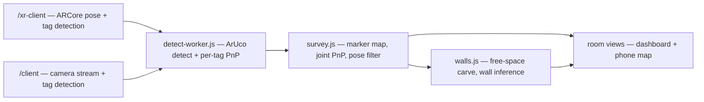
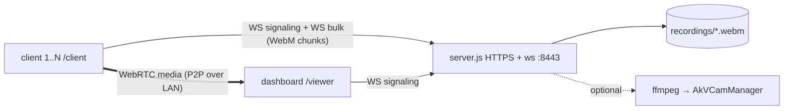

# synora

*syn + hórama — "seeing together".*

Indoor localization and room mapping from a phone, with no infrastructure beyond a few printed tags. ArUco tags fixed around the room define a persistent metric room frame; the phone detects them, and the server surveys the tags into a map, tracks each client's 6-DoF pose in that frame, and carves out the room's free space and walls from the sightlines it accumulates. The primary client is `/xr-client`, which fuses ARCore world tracking with the tags: ARCore carries the pose between tag sightings, the tags remove ARCore's drift and give the session a frame that survives a restart.

Multi-client video streaming (WebRTC to a browser dashboard, per-device recording, optional virtual webcam) is the system's second half, and predates the first. Pose accuracy outranks it: detection runs at native capture resolution by explicit decision.

No build step, no app install: vanilla JS served as static files. A client is any phone pointed at a web page.

## Contents

- [Setup](#setup)
- [Localization at a glance](#localization-at-a-glance)
- [XR client](#xr-client)
- [Tag detection](#tag-detection)
- [Survey and localization](#survey-and-localization)
- [Walls and free space](#walls-and-free-space)
- [Room views](#room-views)
- [Devices and calibration](#devices-and-calibration)
- [Server settings](#server-settings)
- [Streaming](#streaming)
- [Frame sync](#frame-sync)
- [Client roster and remote control](#client-roster-and-remote-control)
- [Virtual webcam](#virtual-webcam)
- [Recordings](#recordings)
- [Project layout](#project-layout)
- [Troubleshooting](#troubleshooting)

## Setup

Requirements: Node ≥ 18. Clients and PC on the same LAN. For `/xr-client`: Android with ARCore and a Chrome that grants WebXR `camera-access` — `/probe` reports what a given device actually grants, measures its tracking drift over a walked loop, and reads out every sensor the browser exposes.

```bash
npm install
npm run fetch-vendor   # opencv.js, three.js — required for positioning
npm start              # or: npm run dev (node --watch)
```

`fetch-vendor` downloads third-party assets into a gitignored directory (`public/vendor/`). Without them the server runs and streams; every positioning feature is disabled, and the startup log lists what is missing.

The server listens on `:8443` (HTTPS + WSS) and prints both URLs and a QR code:

- Dashboard: `https://localhost:8443/viewer`
- Clients: `https://<LAN-IP>:8443/client` (the QR code encodes this); `/xr-client` for positioning

The certificate is self-signed, generated into `certs/` on first run; each device accepts the browser warning once. HTTPS is required — browsers refuse `getUserMedia` and WebXR on non-`localhost` HTTP origins.

There is no test suite, linter, or build step. Verification is manual: start the server, open the pages, watch the server log (connect/disconnect, client roster, survey events, joint-PnP coverage, recording byte counts). Tuning is verified offline by replay against recorded journals — see [Replay harnesses](#replay-harnesses).

**Room setup.**

1. Print tags from `/markers`. Tag edge must be exactly 150 mm including the black border; a scale error there multiplies every distance in the room frame. Measure a printed one — "fit to page" silently returns 150 mm at about 142 mm — and set the real figure in **Server settings** (the dashboard drawer, or the size field on `/markers` itself). It is shown in the dashboard header and persisted server-side. A screen showing `/digital` also works as a tag.
2. Mount tags on the walls, several per room, ideally not all coplanar — tags on two different walls are what removes the planar PnP ambiguity (see below).
3. Calibrate each client at `/calibrate`. Intrinsics are stored per lens and per resolution on the server under the device's id. Uncalibrated clients are flagged `calibrated:false` end to end and are refused the survey.
4. Walk the room with `/xr-client` (or `/client`). The first clean tag becomes the room origin; the rest promote into the map as they are seen alongside known ones.

## Localization at a glance



The division of labour is fixed: **the client knows nothing about the marker map.** It detects tags, solves per-tag camera-frame poses, and publishes observations at ~10 Hz. Every room-frame transform lives on the server.

## XR client

`/xr-client` is a positioning client. It does not stream video at all.

The trade against `/client`: ARCore tracks the camera continuously, so tags become an *anchor* rather than a per-frame requirement — at the cost of a smaller camera image, because WebXR `camera-access` hands over a GPU texture at ARCore's own resolution (measured 860×1920) rather than `/client`'s 4K.

**Two frames.** The XR frame's origin is wherever the session started — arbitrary, but ARCore tracks the camera in it continuously. The room frame is defined by the anchor tag and persists across sessions. The server learns `T_room_xr` the moment a tag is seen and nudges it whenever another is. Between sightings ARCore carries the pose; that is the whole of "tags as anchors".

**Detection on this page has no video track**, so nothing can feed a `MediaStreamTrackProcessor`: the camera is a GL texture only the page's own context can read. The page does `readPixels` and transfers the buffer to the detection worker per frame (`xr-frame` → `xr-result`, the buffer handed back with the result so there is one allocation, not one per frame). Measured before this split: read 30 ms, grab 20, **detect 150**, PnP <5 — all of it on the thread also running the XR frame loop, the DOM overlay and the map, which is why 10 Hz detection delivered 6 poses/s and the map drew at 11 fps.

**Slip detection.** ARCore's VIO can diverge without ever reporting `tracking-lost` — measured, a 5 m/s runaway while the session claimed to be tracking. A windowed net-displacement test flags it, and the slip state deliberately survives re-acquire.

**Jitter** is measured per client as the spread of the tag fix's residual against the ARCore pose, and is the strongest single quality signal in the system — the walls pipeline gates on it directly.

**The camera model was checked and is sound.** Camera image 860×1920 against a 1080×2412 viewport is the same aspect to four decimals; `proj[8] = proj[9] = 0` (centred frustum, no display skew); `fy/fx` 0.9997; mean reprojection error 0.232 px. Fitting a radial distortion term against tag-pair consistency produced a physically absurd optimum that made reprojection *worse*. ARCore returns a rectified image; `dist: [0,0,0,0,0]` is correct.

**On-phone map.** The Map button cycles `off` → `split` → `full`, drawing the same top-down room map the dashboard draws, from the same messages — so a survey can be read while walking it. In `full` the camera returns as a small inset: the passthrough itself cannot be scaled (the UA composites it behind the entire overlay), but the detector already reads the camera image back every frame, so the inset is one `drawImage` of exactly what the detector is looking at. Screen roll is read off ARCore rather than the browser — the phone's orientation lock is deliberate, so `screen.orientation` never fires, while the session's reference space is gravity-aligned and world-up in view coordinates *is* the roll. **Heading-up** and **transparent** toggles sit beside it.

A client with the map on is a *room watcher*: the server fans map, floor and wall messages to it as well as to the dashboard, with slim per-pose messages and whole-snapshot pushes skipped for a socket that already has a backlog.

## Tag detection

`detect-worker.js` + `detect-core.js`, shared by both clients. ~10 Hz, at native capture resolution — pose accuracy is prioritized over CPU here by explicit decision. Detection is the most expensive per-frame work a client does and it must not stall the encoded-frame transform, the recorder or the UI, so it runs on a worker thread; `/client` transfers a track processor's `readable`, `/xr-client` transfers pixel buffers. Both fall back to running the same core on the page (`requestVideoFrameCallback`) when anything goes wrong; with the worker up, opencv.js is never loaded on the page at all.

Three things make native resolution affordable, none of them at the cost of accuracy:

- **Luma only.** Camera frames are YUV and plane 0 is already the grayscale image, so `VideoFrame.copyTo` writes it straight into the wasm heap. The old path drew to a canvas, read back 33 MB of RGBA, copied that into the heap and converted it — four passes over eight megapixels to produce one. The XR path's RGBA buffer goes through the same factory, doing the GL bottom-up flip during the copy it was making anyway.
- **Region-of-interest scanning.** Once tags have been seen, only a crop is scanned; the margin tracks measured tag motion, an empty crop retries the whole frame at once, a drop in tag count forces a full sweep, and one is forced every 700 ms regardless. Crop coordinates are mapped back to full-frame pixels before any pose is solved, so exactly one coordinate space leaves the file.
- **ArUco3 on full sweeps.** Candidates are searched on a downscaled copy, corners refined at full resolution. The downscale factor is `32 / (32 + longEdge * minMarkerLengthRatioOriginalImg)`, which at OpenCV's default ratio of `0` is exactly 1 — setting `useAruco3Detection` alone does nothing. At `0.015` a 4K frame is searched at ~0.36 scale (an 8× area cut) while still accepting a 58 px marker, about 7.5 m out for a 150 mm tag.

Per tag, pose comes from `SOLVEPNP_IPPE_SQUARE`.

**The planar mirror ambiguity is the central problem of this pipeline.** A single planar tag has two PnP solutions with near-identical reprojection error; measured over 84 journals, **10.6% of tag sightings are the wrong branch**, they fit their own corners to under 0.3 px (no reprojection gate can see them), and they arrive in runs (no temporal filter can either). Both solutions therefore ship to the server. The vendored OpenCV build does not export `solvePnPGeneric` to JS, so the second solution is *reconstructed*: the two poses are two local minima of the same reprojection error, so `mirrorRvecGuesses` builds starting guesses and `solvePnPRefineLM` converges into the other basin. The reflection is about the **line of sight** (`2vvᵀ − I`, already a proper rotation), not about the plane perpendicular to it.

## Survey and localization

`survey.js`, server-side.

**Survey.** The first cleanly observed tag becomes the room origin (anchor); it never moves, being the datum. Each pose message from a localized client that also sees unknown tags contributes room-pose estimates for them, and a tag promotes into the map once enough estimates agree with their own median. Known tags refine slowly via leave-one-out camera fixes (a tag never feeds back into its own estimate). The map persists to `markers.json` (debounced atomic writes) and survives restarts.

Load-bearing details, each measured:

- **Aggregation is a median, not a mean.** With 12–27% of sightings mirror-flipped, a mean is pulled degrees off while a median is fine — and a few degrees of tag orientation over a room-scale lever arm is tens of centimetres of implied camera position (7.78° at 3.3 m ≈ 450 mm). `quatMedian` (medoid, then mean of what agrees with it) matches `quatMean` exactly on clean data and degrades only past 50% contamination.
- **A moved tag is re-seeded, not averaged.** The refine EMA is right for drift and wrong for a knock: correcting 40 cm takes ~200 sightings, and the tag drags its neighbours through the shared camera fix for all of them. Persistent disagreement past a threshold drops the tag back to a candidate; measured, a knock is detected in 12 sightings and correct again within ~30, with no false drops at 4× normal observation noise.
- **The anchor is never founded on an ambiguous sighting when an unambiguous one is on offer.** The anchor's orientation *is* the room frame and nothing downstream can detect a wrong datum. If the anchor is the tag that moves, nothing detects that either — the honest response is a full re-survey (remove the anchor in the dashboard, which resets the survey and the carved grid with it).

**Localization.** Two estimators, in order:

1. **Joint multi-tag PnP** — one solve over every visible mapped tag's corners at once. The mirror ambiguity is a property of a *coplanar* point set, so tags on different walls jointly have no mirror at all: a joint solve removes the degree of freedom rather than averaging over it. Gated on off-plane spread (below ~3 cm the set is effectively one plane and the joint solve is *still* ambiguous) and on a 1 px mean reprojection gate. That gate does most of the protecting and is measured, not guessed: at 1.5–3 px rms, 508 solves disagreed with the fuse, 96% of them by more than 0.5 m at a 1.6 m mean — the mirror wearing a plausible residual.
2. **Weighted fuse** — `T_room_cam = T_room_tag ∘ inv(T_cam_tag)` per tag, weighted by distance, reprojection error, viewing angle, *and* consensus with the other tags. The first three cannot see a stale or knocked tag; only disagreement can. It is a soft down-weight and never a reject: with three tags the median is weak, and hard-dropping the odd one out makes the fix jump as tags enter and leave view.

Per-tag mirror choice is resolved against whatever reference is strongest: the pose implied by the *other* tags, the client's last fresh fix, ARCore's own camera pose on the XR path, or — for a tag not yet in the map — its own accumulated candidate ring. Measured, wrong branches reaching the map fell 12.6% → 3.4% on `/client` and 9.4% → 4.5% on XR (worst sessions 56% → 12%), with per-tag orientation MAD 12.8° → 4.0°.

**Filtering.** Observations past ~81° off-normal are dropped outright — a glancing planar PnP is ill-conditioned and its reprojection error does not show it. The *reported* pose is blended against a constant-velocity prediction with a self-tuning gain: innovation is compared to this client's own recent innovation variance rather than a fixed metre figure, so standing still smooths hard and walking follows at once (29 mm → 6 mm of rest jitter, ~45 mm of lag at 0.35 m/s). Only the reported pose is smoothed — survey extension keeps the raw fix, or the map and the filter would agree with each other instead of with the room. A sub-second tag dropout is carried by prediction, reported as `quality: 'dead'`, and never extends the survey.

Expected accuracy is decimeter-level at room scale, dependent on calibration, tag print accuracy, viewing angle and distance.

## Walls and free space

`walls.js`. A 2D top-down log-odds occupancy grid, carved along **camera→tag rays**: an accepted sighting proves the line of sight was empty and puts a wall at the far end. Evidence here is as permanent as `markers.json`, so the design centre is the acceptance gate, not the carve — a sighting must clear the survey's own quarantine flags, be `quality: 'good'`, carry a measured jitter under threshold (absence of a measurement rejects), and pass per-ray error / distance / pixel-size / viewing-angle gates against the **mapped** tag rather than the raw tvec. The last stretch before the tag is deliberately left uncarved so pose noise erodes the margin and never the wall.

- **Wall segments come from coplanar tag groups**, with extents grown only as far as carved free cells in front of the plane attest. An opening is judged by *depth* behind the plane, not by cell count — a doorway is space you can walk through, so its evidence reaches the far end of the inspected band, while pose noise bleeding across a wall is a sliver hugging it. Measured, a one-row sliver still had 27 cells and would have excised 0.84 m of real wall.
- **No emitted wall may cross a proven line of sight.** Every accepted ray is kept in geometric form, deduped per viewpoint cell, persisted alongside the grid, and a segment is cut wherever a quorum of distinct viewpoints looked through it. The old rule was a *tolerance* — it let an extension cross up to a metre of provably-free space by policy, so the very doorway the extent logic excised was re-crossed by the corner-closer, measured at 2.02 m across a 0.72 m doorway.
- **Inference may not exceed evidence:** no extension may be longer than the attested part of the wall it extends. Before that bound, a wall attested over 0.96 m spanned the room at 4.37 m.
- **Negative evidence.** A mapped tag that should have been comfortably visible — in frame, inside the region the detector actually scanned, facing the camera, near, large in expected px — but absent from the report deposits weak occupancy along its ray, in a separate accumulator that structurally cannot touch the positive one. Where on the ray the obstruction sits is unknowable from one viewpoint, so promotion needs several distinct viewpoints; crossing rays concentrate exactly where a single obstruction explaining all of them must sit. Enclosed never-visited pockets of furniture size are read the same way. Both ship as a third `deduced` class, rendered amber, derived at read time and never persisted.
- Three metrics, all needed: **leaks** catch walls drawn too wide, the **extent audit** catches walls eaten too narrow, and **blocked/grazed sight crossings** catch a wall standing in open space — the one whose absence let that bug come back repeatedly.

The grid persists to `walls.json` (refused on a marker-size or cell-size mismatch) and resets with the survey when the anchor is removed — it was measured in that room frame.

**Depth-based room mapping was removed** (a monocular depth model, voxel occupancy, `/depth-calibrate`). At the depth error available, walls landed metres out and no filtering fixed it. This feature replaces it from a different source — tag-localized poses — and **walls still take no depth evidence at all**.

The ban that removal left behind asked for a measurement, and `replay-depth.js` is it: every detected tag carries both a depth sample and the distance the tag solver already knows for that same pixel, so the error distribution can be read straight off the recorded journals. Measured over 4534 sampled sightings, ARCore's depth is good to a median 60-74 mm out to 3 m — about one grid cell — and to 0.9-1.7 m beyond that, reproducing the old failure on a new source. The one consumer that ever read it — a founding prior for the landmark feature — went with that feature when it was removed, so nothing in the product reads depth today. The phone still journals the samples, so the measurement stays available to whatever asks next. It never places a surface.

## Room views

Three dashboard views — **3D** (three.js), **Top** (floor plan) and **Side** (elevation) — plus the same top-down map on the phone. They are pure renderers fed by one shared feed (`room-feed.js`), so the two surfaces cannot disagree; the room palette lives in `common.js` because the XR page cannot load three.js. `map2d.js` takes an injectable frame source, since inside an immersive session the page's own `requestAnimationFrame` is not guaranteed to run.

They draw surveyed tags, live client poses, and (2D only) the carved free-space, deduced and wall layers. Removing a tag: double-click it in the floor plan. Removing the anchor resets the entire survey.

**Nothing in a room view changes between two frames** (`anim.js`). A survey change arrives as a whole new map, a carve as a whole new raster, so every setter *matches* the arriving snapshot against what is on screen — tags by id, walls by tag-set then endpoint proximity, floors by cross-fade — and moves it there. Motion is an exponential approach; fades are a linear ramp, because an entity is deleted when its fade reaches zero and an exponential never gets there (measured: a "300 ms" exponential fade left a removed tag 4% visible after a full second). Anything eased must also be *derived* from the eased value, or tag legs and client→tag lines detach from what they belong to mid-glide.

## Devices and calibration

The browser stores exactly one thing: a UUID. Everything tied to it — capture settings and, above all, camera calibration — lives on the server in `devices.json`, keyed by that id.

Calibration is why. Fifteen careful ChArUco captures used to live in `localStorage`, where clearing site data or switching browsers destroyed them silently: the client simply started reporting a derived model, or an outright FOV guess, and every distance in the room went with it. Uncalibrated clients are refused the survey outright — a ~5% scale error would be permanent in `markers.json`.

**Recovering a lost id**, two ways. *Automatically:* each device stores a hardware fingerprint (GPU string, physical screen geometry, model parsed from the user agent, camera labels, cores, memory, platform, languages, timezone), and a browser arriving with no id is scored against every stored one. It adopts a device only when one candidate is both strong on its own **and** clearly ahead of the runner-up — two identical phone models fingerprint identically, and adopting the wrong one hands a phone another phone's camera model with nothing downstream able to tell. Browser and OS versions are excluded: they change on their own. Every decision is logged. *By hand:* a picker listing each device by name, last-seen time and what it is calibrated for, reachable any time from the id chip in the header.

**Ordering.** A capture page resolves its identity and applies its stored settings *before* it opens the camera — size and lens are fixed at `getUserMedia` time, and reopening the camera would take the recording and the peer connection with it. An unreachable server leaves the defaults standing rather than sitting dark.

Intrinsics always describe the **full frame** — crops offset corners, they never rescale the camera model — and are stored per lens and resolution with rotation-aware and scale-aware fallbacks. Calibrating at the resolution you stream at beats the linear rescale.

## Server settings

The knobs that belong to the *room* rather than to a device, in the dashboard drawer under **Server settings**, persisted in `pose-settings.json` and applied without a restart. The schema lives in `settings.js` and is sent to the dashboard, which builds the form from it — a new setting appears there with its label, bounds, units and help text without touching the viewer.

| Setting | Default | What it does |
| --- | --- | --- |
| Tag size | 150 mm | Printed tag edge, the room's only metric datum. **Clears the survey and the carve** — every tag position was measured at the old scale. |
| Detection interval | 100 ms | How often a client attempts a tag detection. Pushed to every connected client at once. |
| Wall carving | on | Whether accepted pose reports carve free space. Off, the grid stops growing but is kept — the wipe that throws it away is its own control. |
| Pose journal | on | Whether observations are recorded to `recordings/*.pose.jsonl`. This is what the replay harnesses re-run, so it is on by default. |

Tag size is also settable from `/markers` (the page that prints the sheet, which has no dashboard socket) and is shown in the dashboard header: every distance on that page scales by it, and a wrong one is invisible in all of them — the room simply comes out uniformly too big. A change made from either place reaches the other immediately. `GET`/`POST /api/settings` is the same path for anything without a page open.

## Streaming

N clients ↔ server ↔ 1 dashboard. Live media never touches the server.



Each client holds two WebSockets under one identity: a signaling socket for small latency-sensitive JSON, and a bulk socket for recorder chunks. The split exists so bulk bytes cannot queue ahead of pose or signaling messages.

Server responsibilities: relay signaling verbatim (one dashboard at a time, a new one displaces the old); append bulk chunks to the client's recording; run the survey; keep the roster; tee to the virtual webcam.

**Client identity.** A new socket for an existing id closes the old one; the old socket's close handler checks it still owns the id before cleaning up, so a reload race cannot orphan a client.

**Liveness.** Android freezes backgrounded pages and tears down their connections without a `close` event; the socket stays nominally `OPEN`. Every page runs an explicit ping/pong probe plus one on `visibilitychange`, and treats an unanswered ping as a dead socket. `readyState` is not trusted.

**Recovery.** Backgrounding can take the camera, recorder and peer connection at once. `restartCall()` is the single recovery path, re-entrancy guarded so a request arriving mid-restart is replayed rather than dropped. Pause disables tracks and parks the recorder without tearing anything down, so a recording spans a pause as one file.

**Resolution and bitrate.** Capture defaults to 4K with `ideal` constraints. Size, lens, mic and marker-tracking state persist per device on the server. Recorder bitrate is tiered by actual capture size: 16 Mbps ≥ 4K, 8 Mbps ≥ 1440p, 4 Mbps below.

## Frame sync

The dashboard's combined view composites all feeds onto one canvas, and feeds arrive with different end-to-end latencies.

1. **Clock sync.** Clients and dashboard each run NTP-style probes against the server clock — the only shared timebase, anchored once and advancing monotonically so an OS resync cannot step it. Low-RTT samples from a sliding window are least-squares fitted; the slope is crystal drift, and tracking it is what holds a long session together (a fixed offset goes tens of ms stale within minutes). A run of samples no round trip can explain clears the window.
2. **Client side.** `encodedInsertableStreams` exposes each encoded frame's RTP timestamp; the client publishes `{rtp, serverTime, unc}` pairings at 8/s and inserts the abs-capture-time header extension with an id free across the whole SDP (BUNDLE requires one meaning per id; ids above 14 need the two-byte form, so allocation stops there).
3. **Dashboard side.** `requestVideoFrameCallback` reports each displayed frame's RTP timestamp; conversion goes through the 90 kHz clock, wraparound-aware. Among *recent* pairings the one implying the earliest capture wins — encode delay is always positive, and the recency window is what lets the estimate reconverge after a client's clock estimate moves. Frames are buffered per device and the one nearest the shared presentation instant is drawn.

Cost: ~70 ms of extra latency in the combined view only; the tile grid stays live. Buffered bitmaps are downscale-capped — a 4K feed must not pin ~30 MB per buffered frame — and one place owns closing them, since leaking these leaks GPU memory fast at 30 fps × N devices.

Header readout: `sync ±N` is the misalignment of the frames actually drawn (floor: half a frame interval). `lag spread` is the latency difference the sync compensates — not an error. `clock ±N` is the worst client's clock uncertainty, which the sync figure structurally cannot observe (the dashboard's own clock error shifts all feeds together and cancels; a client's does not).

## Client roster and remote control

The **Clients** drawer lists every connected client and drives it. A client only gets a video tile once its peer connection is up, and `/xr-client` never opens one at all — so the drawer, not the tile grid, is the honest answer to "what is connected". The header reports both counts.

Per client: requested and delivered capture size, lens, mic, marker tracking, paused and blanked state, AR session state, the room fix and its age, link latency, clock uncertainty, recording size, uptime.

Controls, all of which are also on the client's own header: resolution, mic, marker tracking, pause, blank screen, front/rear lens, new recording, virtual webcam assignment. An XR client is offered only **Blank** — it has no mic, no recorder and no resolution to pick.

Nothing in the drawer is optimistic. A control sends the *wanted* state (never a toggle — the drawer renders state up to a second old, and a toggle raced against a stale view lands inverted), the client performs it and reports back, and only then does the button change.

**Blank screen.** Both capture pages can black out the display while capture, detection and streaming continue. The wake lock holds the screen on for the whole session and the display is the largest single draw on the phone; blanking it is the only meaningful power saving a page can make. On `/xr-client` the black mounts on the WebXR DOM overlay root, since inside an immersive session that subtree is the only thing composited over the passthrough.

## Virtual webcam

Windows only. Exposes the selected client's feed as a system webcam. Enabled when both pieces exist:

1. [AkVirtualCamera](https://github.com/webcamoid/akvirtualcamera/releases), with a device created:

```bat
"%ProgramFiles%\AkVirtualCamera\x64\AkVCamManager.exe" add-device "Phone Stream"
"%ProgramFiles%\AkVirtualCamera\x64\AkVCamManager.exe" add-format AkVCamVideoDevice0 RGB24 1280 720 30
"%ProgramFiles%\AkVirtualCamera\x64\AkVCamManager.exe" update
```

2. `ffmpeg.exe` in `tools/`.

The active client's chunk stream is teed into `ffmpeg`, decoded, and piped to `AkVCamManager stream` at 1280×720@30. Detection re-runs when a viewer connects, so a driver installed after startup is picked up without a restart.

## Recordings

- Path: `recordings/<stamp>_client<id>.webm`.
- A new file starts on connect/reconnect, camera switch, mic toggle, resolution change, and the new-recording button. Pause does not split the file.
- Pose journals are written beside them as `.pose.jsonl` and are the input to the replay harnesses.
- Retention is manual; disk space is the only limit.
- A 0-byte file means the client's screen was off or the page was backgrounded — the camera delivers no frames there.

## Replay harnesses

Positioning tuning is measured against recorded journals, not argued. Each harness feeds recorded lines through the *same* function the server runs:

```
replay-survey.js     marker map + pose: map error, joint-PnP coverage, jumps
replay-walls.js      carve + walls: leak count, extent audit, sight crossings
replay-tagbias.js    per-tag mirror-branch and orientation statistics
replay-depth.js      ARCore depth against the tag solver's own distance
```

Compare replays only against a *fixed* `markers.json` — the live server rewrites it mid-session, and a moved map silently invalidates a "before" number.

## Project layout

```
server.js              HTTPS + WS: signaling relay, recording sink, vcam
survey.js              marker map, joint PnP, localization, pose filter
walls.js               free-space carve, wall inference, negative evidence
devices.js             device registry: settings, calibration, fingerprints
settings.js            persisted server settings: schema, store, validation
replay-*.js            offline measurement harnesses
fetch-vendor.js        downloads opencv.js / three.js
public/
  xr-client.js/.html   ARCore pose + tag detection + on-phone map
  client.js/.html      camera, MediaRecorder, peer connection, recovery
  pose.js              pose sockets, intrinsics, stats, on-page fallback
  detect-worker.js     worker thread: camera frames in, tag poses out
  detect-core.js       detector objects, scan strategy, PnP, mirror branch
  pose-math.js         quaternion / SE(3) helpers, solvePose (shared with server)
  cv-common.js         opencv loading, intrinsics store, detector + luma factories
  common.js            signaling socket, liveness, clock sync, screen blank,
                       device identity + fingerprint + picker, room palette
  room-feed.js         room messages -> renderer calls (dashboard and phone)
  scene.js             3D room view (three.js)
  map2d.js             floor plan + elevation + phone map
  anim.js              snapshot matching and easing for the room views
  viewer.js            tiles, combined canvas, frame sync, client model
  clients-panel.js     client roster drawer + remote controls
  calibrate.js/.html   ChArUco camera calibration
  markers.js/.html     printable tag sheet
  digital.js/.html     exact-size on-screen tag
  probe.js/.html       device capability readout: WebXR, drift, sensors, flags
  viewer.html · index.html · style.css
certs/                 self-signed cert, generated on first run   (gitignored)
recordings/            video + pose journals                      (gitignored)
tools/                 ffmpeg.exe for the virtual webcam          (gitignored)
public/vendor/         fetched opencv.js / three.js               (gitignored)
markers.json           surveyed marker map                        (gitignored)
walls.json             carved occupancy grid + sight lines        (gitignored)
devices.json           per-device settings + camera calibration   (gitignored)
pose-settings.json     persisted server settings                  (gitignored)
```

Conventions: dates/times are 24-hour `dd/mm/yy`, formatted only by the helpers in `server.js` — no `toLocaleString`. Comments explain why, not what. Shared client/viewer logic lives in `common.js`; shared CV definitions in `cv-common.js`; transform math in `pose-math.js`.

## Troubleshooting

| Symptom | Cause / fix |
|---|---|
| Certificate warning | Self-signed; accept once per device. |
| Client cannot reach the server | Same Wi-Fi required; AP client isolation must be off; firewall must allow Node on 8443. |
| Cert invalid after an IP change | Delete `certs/` and restart — regenerated with current addresses in the SAN. |
| `/xr-client` starts, screen black, nothing happens | WebXR needs a WebGL base layer to composite the passthrough into, and `dom-overlay` is optional. Run `/probe` to see what this device actually grants. |
| XR client localized, then everything drifts | ARCore VIO divergence — it never reports `tracking-lost`. The slip detector flags it; walk back to a tag to re-acquire. |
| Overlay red, UNCALIBRATED | No stored calibration for that lens — run `/calibrate`. Poses fall back to an FOV guess and the server refuses such a client the survey: a ~5% scale error would be permanent in `markers.json`. |
| Overlay amber, "rotated" / "scaled from WxH" | Working from a derived model — calibrated in the other orientation or at another resolution. Usable; calibrate in the orientation and resolution you stream at to clear it. |
| Overlay amber, "turn direction unknown" | The stored calibration predates orientation recording. Recalibrate once in each orientation. |
| Tags move when the client is turned | The symptom the above two exist to make visible. `/calibrate` in both orientations. |
| Tags detected but no room fix | No surveyed tag in view. The survey grows from the anchor: show a known and an unknown tag together, repeatedly. |
| A tag sits visibly wrong in the map | Mirror branch. It heals as the tag is re-observed; if the tag was physically knocked it re-seeds itself in ~30 sightings. If the *anchor* moved, nothing can detect it — remove the anchor and re-survey. |
| Distances uniformly wrong | Printed tag size ≠ the configured size (shown in the dashboard header). Reprint at exact scale, or measure the sheet and set **Tag size** in Server settings. |
| Walls appear across a doorway | Every mapped tag asserts wall for a radius around it — the weakest evidence in the module. Look *through* the opening from several viewpoints; a quorum of sight lines cuts the segment. |
| Amber cells where nothing is | Deduced occupancy from blocked rays — a person standing there does this honestly. It clears when the space is re-carved free. |
| Positioning features absent at startup | `npm run fetch-vendor` not run; the startup log names what is missing. |
| "sync unavailable" | Browser lacks encoded-frame access, or no free extmap id. Combined view works unsynced. |
| Recording is 0 bytes | Screen off / page backgrounded on the client. |
| Second dashboard kicks the first | By design. |
| No Webcam button | Missing `tools/ffmpeg.exe`, AkVirtualCamera, or device. Startup log names which. |
