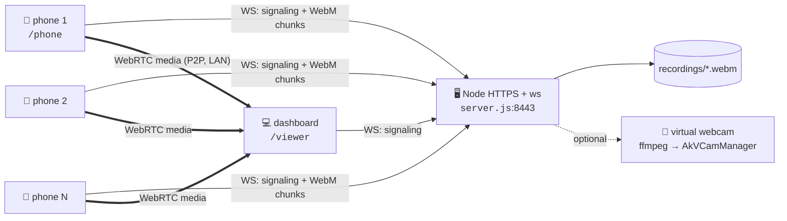

# android-streamer

Turn any number of phones into live cameras on your PC — sub-second latency over your own Wi-Fi, no cloud, no app install.

<p>
  
  
  
  
  
</p>

Phones open a web page, the PC opens a dashboard, and media flows **directly phone → PC** over the LAN. The server only relays signaling, writes recordings, and (optionally) exposes a feed as a virtual webcam.

---

## Table of contents

- [Quick start](#quick-start)
- [Features](#features)
- [How it works](#how-it-works)
- [Frame sync](#frame-sync)
- [Virtual webcam (Windows, optional)](#virtual-webcam-windows-optional)
- [Recordings](#recordings)
- [Project layout](#project-layout)
- [Troubleshooting](#troubleshooting)

---

## Quick start

```bash
npm install
npm start        # or: npm run dev  (node --watch, restarts on file change)
```

The server prints both URLs plus a QR code:

```
Viewer (this PC):  https://localhost:8443/viewer
Phone (same LAN):  https://192.168.1.42:8443/phone
```

1. **PC** — open `https://localhost:8443/viewer` (`/dashboard` works too).
2. **Phones** — scan the QR code, or open `https://<PC-IP>:8443/phone`. Same Wi-Fi as the PC.
3. Both devices show a *"connection is not private"* warning once — **Advanced → Proceed**. The certificate is self-signed and generated into `certs/` on first run.
4. Allow camera access on the phone. Tiles appear on the dashboard immediately.

> [!NOTE]
> HTTPS is mandatory, not decoration — browsers refuse `getUserMedia` on a plain-HTTP origin that isn't `localhost`.

---

## Features

| | |
|---|---|
| **Multi-device dashboard** | Every connected phone gets a live tile; header shows the device count. Click a tile to enlarge, click again to return. |
| **Combined view** | Composites all feeds onto one canvas in an auto grid, labeled per device. Frame-synced (see below). |
| **Sub-second latency** | WebRTC peer-to-peer over the LAN. Media never passes through the server. |
| **Automatic recording** | Every session lands in `recordings/<timestamp>_phone<id>.webm`. No button to forget. |
| **Stable device identity** | A phone keeps its number, tile, and filename prefix across reloads. |
| **Camera switch** | Rear ⇄ front. Starts a new recording file. |
| **Microphone** | Off by default. Toggling includes audio in both the live stream and the recording, and starts a new file. On the dashboard, click **Sound: off** to unmute. |
| **Resolution** | 480p / 720p / 1080p; the camera picks the closest supported mode. Change starts a new file. |
| **Pause** | Tap the phone's feed. Tracks go silent, the recorder parks — the recording stays in *one* file and resuming is instant. |
| **New-recording button** | Cuts the current file and opens the next one, without touching the stream. |
| **Recovery** | Auto-reconnect on both sides, plus explicit re-acquisition of camera / recorder / peer connection after Android backgrounds the page. |
| **Screen wake lock** | Kept while streaming, retaken whenever the page becomes visible again. |
| **Virtual webcam** | Windows only, optional — route a phone into any app that takes a webcam. |

---

## How it works



**Zero build step.** Vanilla JS, no bundler, no modules — the browser pages share globals by load order (`common.js` first, then `phone.js` / `viewer.js`). Three runtime dependencies: `ws`, `selfsigned`, `qrcode-terminal`.

The server does exactly three things:

**1. Signaling relay.** One WebSocket per client. `offer` / `answer` / `ice` are relayed verbatim; phone→viewer messages are tagged with a `phoneId`, viewer→phone messages carry one for routing. A second viewer displaces the first.

**2. Recording sink.** Binary WS frames from a phone are `MediaRecorder` chunks, appended to that phone's current file. Recording state lives on the socket, so a new socket always needs a fresh recorder — the first chunk carries the WebM header. That is why the phone rebuilds its `MediaRecorder` on reconnect, camera switch, mic toggle, and resolution change.

**3. Virtual webcam tee** (optional, Windows) — see below.

**Phone identity.** Each client persists a UUID in `localStorage` and presents it on every connection; the server maps it to a stable small integer. Reload races are handled explicitly: a new socket for an existing id closes the old one, and the old socket's `close` handler bails if it no longer owns the id.

**Liveness.** Android freezes a backgrounded page and the OS tears connections down underneath it — the socket stays nominally `OPEN` and no `close` event ever fires. So both pages run an explicit `ping`/`pong` probe (plus a probe on `visibilitychange`) and treat an unanswered ping as a dead socket. `readyState` alone lies.

**Server logs are the diagnostic surface** — connect/disconnect, a client roster table (id / resolution / mic), recording open/close with byte counts, and `ffmpeg` / `AkVCamManager` stderr.

---

## Frame sync

Naive compositing mixes moments captured milliseconds apart, so the Combined view aligns feeds against a shared timebase:

1. **Clock sync** — phone and dashboard each run an NTP-style `time-ping`/`time-pong` against the server clock, which is the only timebase both sides share (and which advances monotonically from a single anchor, so an OS time resync cannot step it). Low-RTT samples from a two-minute window are fitted with a line: the intercept is the offset, the slope is the drift between the two crystals. Tracking that slope matters — at 50 ppm a fixed offset is 30 ms stale after ten minutes, and two phones drifting opposite ways pull their feeds twice that far apart.
2. **Phone side** — encoded-frame access exposes each frame's RTP timestamp, which the phone publishes paired with a server-clock instant (8/s), along with its own clock uncertainty.
   The abs-capture-time extmap is inserted into the SDP with an id free across the *whole* offer (BUNDLE requires one meaning per id).
3. **Dashboard side** — `requestVideoFrameCallback` gives each displayed frame's RTP timestamp; among the pairings from the last 20 seconds, the one implying the earliest capture wins (encode delay is always positive). The window is what lets the mapping reconverge — a lower envelope kept over all of time can never let go of a stale winner. Frames are buffered per device and the one nearest the shared presentation instant is drawn.

The header reports `sync ±N ms · lag spread N ms · clock ±N ms`:

- **sync** — how far the worst frame actually drawn sat from the shared presentation instant. The floor is half a frame interval (~16 ms at 30 fps), since a feed can only show frames it was sent.
- **lag spread** — the difference in end-to-end latency between the fastest and slowest phone. This is what the sync corrects for, not an error; tens of milliseconds here is normal and does not mean the feeds are misaligned.
- **clock** — the worst phone's own clock uncertainty. The dashboard's clock error shifts every feed together and so cancels out of the alignment, but a phone's does not, and the `sync` figure cannot see it.

Cost: roughly **70 ms of extra delay in the Combined view only** — the tile grid stays live.

---

## Virtual webcam (Windows, optional)

Exposes the active phone's feed as a normal webcam device, selectable in Zoom, OBS, Teams, anything. The server enables the feature only when it finds both pieces:

**1. [AkVirtualCamera](https://github.com/webcamoid/akvirtualcamera/releases)** — install, then create the device:

```bat
"%ProgramFiles%\AkVirtualCamera\x64\AkVCamManager.exe" add-device "Phone Stream"
"%ProgramFiles%\AkVirtualCamera\x64\AkVCamManager.exe" add-format AkVCamVideoDevice0 RGB24 1280 720 30
"%ProgramFiles%\AkVirtualCamera\x64\AkVCamManager.exe" update
```

**2. `ffmpeg.exe`** — any recent Windows build, placed in `tools/`.

The server logs `Virtual cam ready` and a **Webcam** button appears on each dashboard tile. Click one to route that phone in, click again to stop. Detection re-runs whenever a viewer connects, so a driver installed after startup is picked up without a restart.

---

## Recordings

- Path: `recordings/<yyyy-mm-dd>_<hhmmss>_phone<id>.webm` — plays in VLC or any browser.
- A new file starts on: connect/reconnect, camera switch, mic toggle, resolution change, and the record button. Pausing does **not** start a new file.
- Only limited by disk space. Delete old files manually.
- **A 0-byte recording** almost always means the phone's screen was off or the browser was backgrounded — the camera stops delivering frames there. Keep the phone page in the foreground.

---

## Project layout

```
server.js              HTTPS + WS: signaling relay, recording sink, virtual cam
public/
  common.js            shared: signaling socket, liveness probe, clock sync
  phone.js             camera, MediaRecorder, peer connection, recovery
  viewer.js            tiles, combined canvas, frame buffering + sync
  phone.html
  viewer.html
  style.css
certs/                 self-signed cert, generated on first run   (gitignored)
recordings/            output                                     (gitignored)
tools/                 ffmpeg.exe for the virtual webcam          (gitignored)
```

Conventions: dates/times are 24-hour `dd/mm/yy`, formatted only by the two helpers in `server.js` — no ad-hoc formatting, no `toLocaleString`. Comments explain *why* (the race, the platform quirk, the ordering constraint), not what. Shared phone/viewer logic lives in `common.js`.

There is no test suite, linter, or build step — verification is manual: start the server, open both pages, watch the logs.

---

## Troubleshooting

| Symptom | Cause / fix |
|---|---|
| Certificate warning on every device | Expected — self-signed. **Advanced → Proceed** once per device. |
| Phone page can't reach the server | Both devices must be on the same Wi-Fi, and the network must not be set to *client isolation*. Check the Windows firewall allows Node on port 8443. |
| Cert stopped matching after an IP change | Delete `certs/` and restart; it is regenerated with the current LAN addresses in the SAN. |
| Recording is 0 bytes | Phone screen was off or the page was backgrounded. Keep it foreground. |
| Dashboard says "sync unavailable" | The browser lacks encoded-frame access, or the abs-capture-time id could not be allocated. Combined view still works, just unsynced. |
| Second dashboard kicks the first | By design — one viewer at a time. |
| No **Webcam** button | `tools/ffmpeg.exe` missing, AkVirtualCamera not installed, or no device configured. The startup log names which. |
